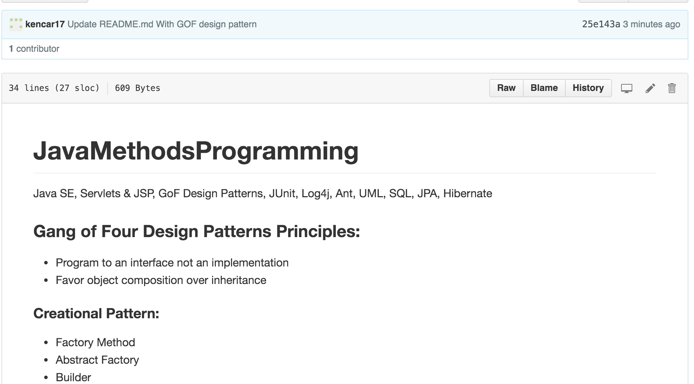

#Java Methods Progarmming

It is a Java repositary that the owner is using to learn Java methods. The methods the owner is 
trying to learn are Java SE, Servlets & JSP, GoF Design Patterns, JUnit, Log4j, Ant, UML, SQL, 
JPA, Hibernate.

Initally i was going to do some work with a swift project but after reviewing and studying the project,
i came to the realization that I could not do anything with the project and decided to find something
else. And that is how i found this project.

##README.md (Artifact 1)

After I decided to work on this project I notced that there was no README.md for it. So I decided to 
create one for it.

The README.md covers what the repositary is being used for. As well as of right now covers the GOF 
design patterns.

The README.md can be found [here] (https://github.com/kencar17/JavaMethodsProgramming/blob/master/README.md).

## Wiki Page (Artifact 2)

The next thing i noticed was that the project had no wiki page to give any details about the design 
patterns. So I created wiki page with a home page and a GOF design patterns page that gives a 
defination of what the pattern is suppose to do and a diagarm of the layout of said pattern.

![Wiki Page] (readme.png)

The wiki can be found [here] (https://github.com/kencar17/JavaMethodsProgramming/wiki/GOF-Design-Patterns).

