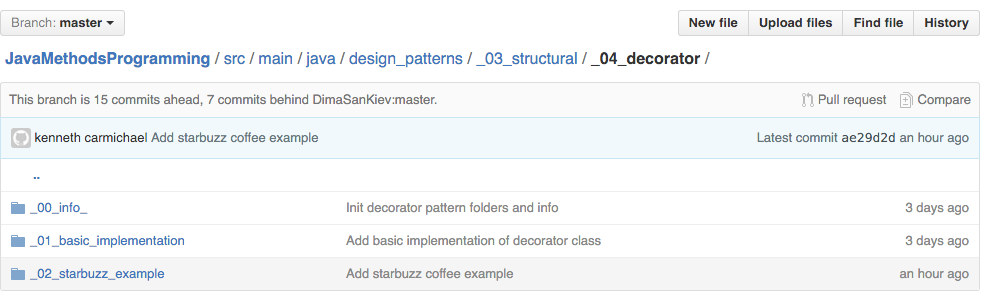

#Continuing work on Java Methods Programming

## Decorator Example(Artifact three)

The next item I decided to do with this project is to add a decorator example. Where 
one classes takes in another class and both of them extend the same abstract class and
both add functionality. 

There are three sub directories for this part
- Info: decribing the pattern, with a diagarm of it
- Basic example
- Starbuzz example: Coffee house

It can be found [here] (https://github.com/kencar17/JavaMethodsProgramming/tree/master/src/main/java/design_patterns/_03_structural/_04_decorator).

The starbuzz example required 9 classes.
- 3 Coffee type classes
- 3 add ons type classes
- 1 Condiment Decorator classs
- 1 Beverage abstract class
- 1 Demo class (Runs the progarm)

![Example Code from a class] (class.png)

The dicrectory for the classes can be found [here] (https://github.com/kencar17/JavaMethodsProgramming/tree/master/src/main/java/design_patterns/_03_structural/_04_decorator/_02_starbuzz_example).

## Pull Request (Artifact four)

After adding a README.md and wiki along with it, and the decorator example I created. It was time to 
do a pull request to intergrate with upstream.
 1. 
 
![Pull Request] (pr.png)

The  Pull Request can be found [here] (https://github.com/DimaSanKiev/JavaMethodsProgramming/pull/1).

